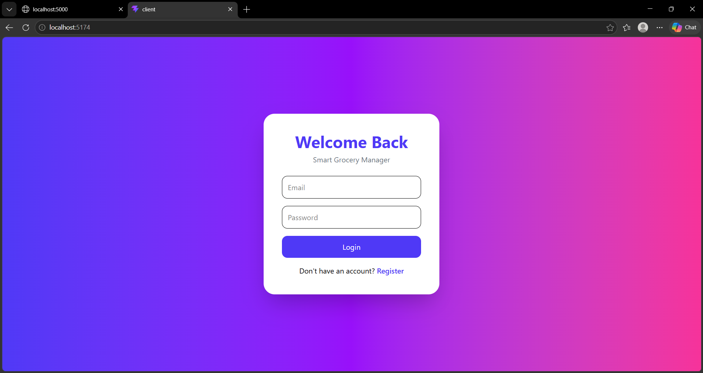
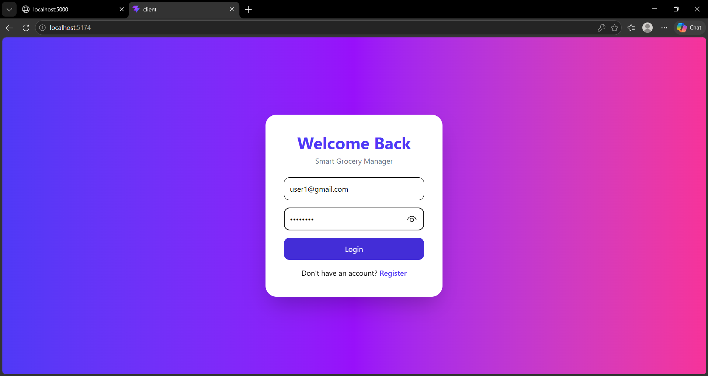
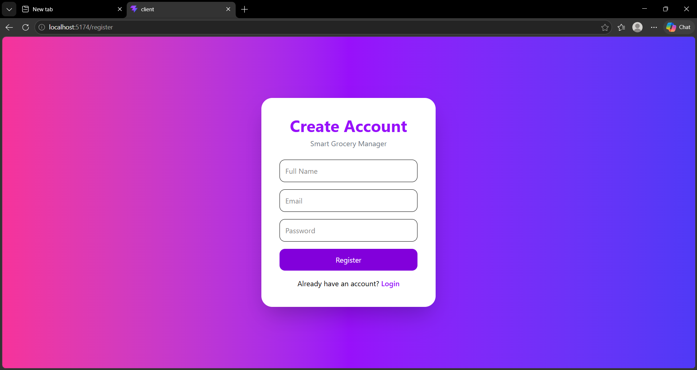
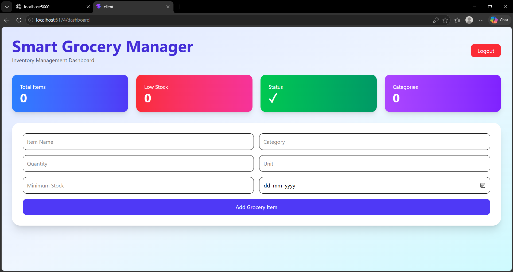
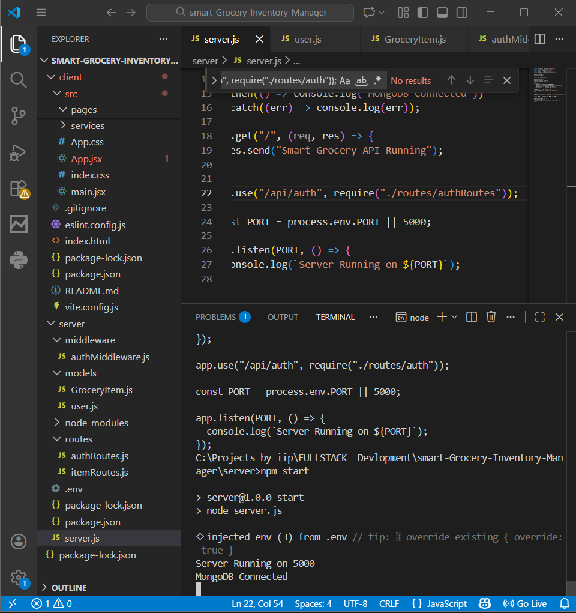
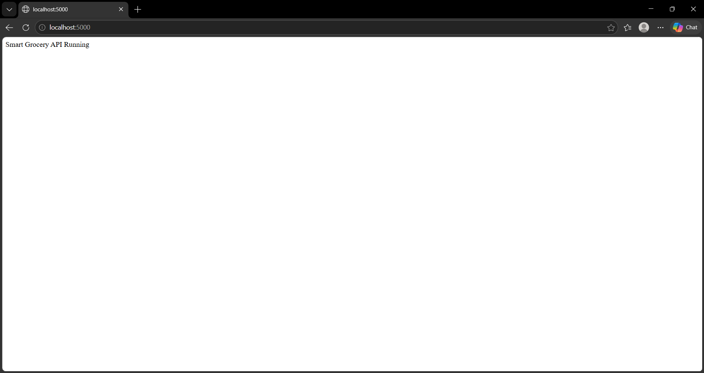

# Smart Grocery Inventory Manager

A modern full-stack Grocery Inventory Management System built with React, Node.js, Express, and MongoDB.

## Features

* User Registration & Login
* JWT Authentication
* Add Grocery Items
* Delete Grocery Items
* Low Stock Alerts
* Category Tracking
* Dashboard Analytics
* Responsive UI

## Tech Stack

### Frontend

* React
* React Router
* Axios
* Vite

### Backend

* Node.js
* Express.js
* MongoDB
* Mongoose
* JWT Authentication

## Screenshots

### Login Page

### Registration Page

### Dashboard

### Add Grocery Item

### backend/api

## Installation

### Clone Repository

git clone https://github.com/sanskritika2409/Smart-Grocery-Inventory-Manager.git

### Backend Setup

cd server

npm install

npm start

### Frontend Setup

cd client

npm install

npm run dev

## Environment Variables

Create .env file inside server folder

MONGO_URI=your_mongodb_connection_string

JWT_SECRET=your_secret_key

PORT=5000

## Author

Sanskritika Awasthi
